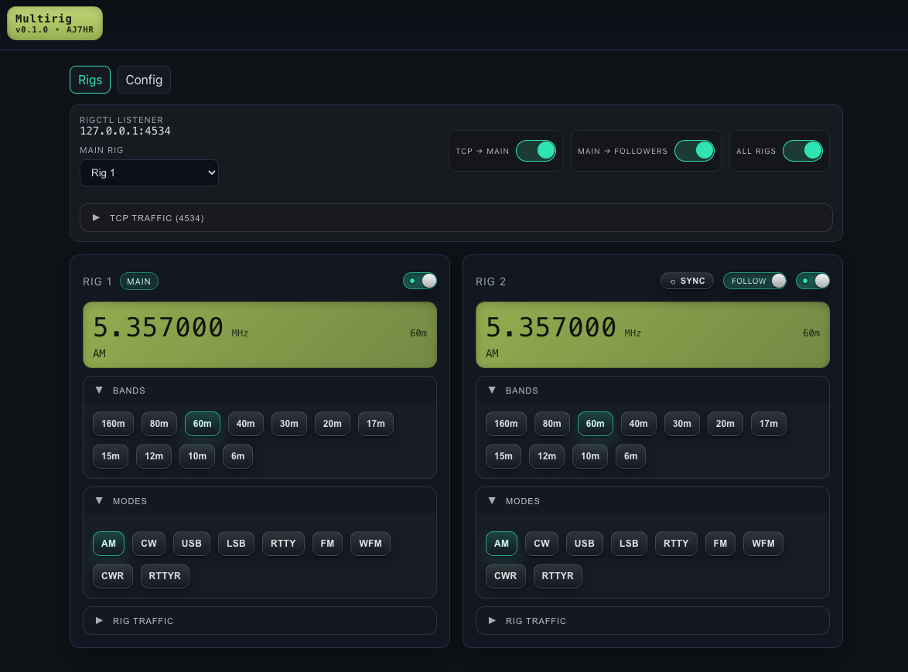

# MultiRig

Control and sync multiple ham radio rigs with a modern, dark‑mode / retro-LCD web UI. Choose one rig as the source and MultiRig mirrors its frequency/mode to all the others. Runs on macOS, Linux, and Raspberry Pi.



## Requirements
- Python 3.9+
- hamlib tools in PATH (for `rigctld` and/or `rigctl`)
  - macOS: `brew install hamlib`
  - Debian/Ubuntu/RPi: `sudo apt-get install hamlib` (or `hamlib-utils`)

## Development tools
- Node.js + npm (for Jest + Playwright)
- `uv` (recommended when using `make` targets)

## Quick start (recommended)
Run the helper script — it creates a virtualenv, installs deps, and starts the app.

```
bash run.sh
```
Then open http://localhost:8000

If you want a repo-contained Hamlib build (used by E2E tests), use:

```
make run
```

Environment variables for `run.sh`:
- `PYTHON` (default `python3`)
- `VENV` (default `.venv`)
- `HOST` (default `0.0.0.0`)
- `PORT` (default `8000`)
- `OPEN_BROWSER` set `0` to disable auto‑open (default `1`)
- `REINSTALL_DEPS` set `1` to force reinstall editable deps

## Other ways to run
- Using uv (module entry point):
  ```
  uv run -m multirig
  ```
- Using uvicorn directly:
  ```
  uv run python -m uvicorn multirig.app:create_app --factory --host 0.0.0.0 --port 8000
  ```
- Using Python:
  ```
  python main.py
  ```
- After installing the package (editable):
  ```
  pip install -e .
  multirig
  ```

## Testing

MultiRig has three test layers:

- Python unit tests (`pytest`)
- Frontend JS unit tests (`jest`)
- Browser E2E tests (`playwright`)

### Run all tests

```
make test
```

### Python unit tests

```
make test-py
```

### JS unit tests

```
make test-js
```

### Playwright E2E tests

```
make test-e2e
```

Notes:

- The Playwright config (`playwright.config.js`) starts:
  - MultiRig via `./run.sh`
  - A dummy `rigctld` for Hamlib on port `4532` (from `ext/hamlib/prefix/bin/rigctld`)
  - The Netmind test proxy service on port `9000` (from `ext/netmind`)
- E2E tests run MultiRig with `MULTIRIG_TEST_MODE=1` to avoid writing `multirig.config.yaml`.
- If you haven’t built the repo-local Hamlib yet, run `make all` (or `make run`) first.

## Writing Playwright tests

E2E tests live in `e2e-tests/`.

### Config setup via profiles

Tests should use configuration profiles instead of calling `/api/config/import` directly.

- Create a unique profile name prefixed with `test_`.
- Use `ensureProfileExists()` with `allowCreate: true` to create the profile if missing.
- Load it with `loadProfile()`.
- Delete it in `finally` using `deleteProfile()`.
- Assert that `ensureProfileExists(..., { allowCreate: false })` throws after deletion.

Helpers:

- `e2e-tests/profile_helpers.js`
  - `ensureProfileExists(request, name, { allowCreate, configYaml })`
  - `loadProfile(request, name)`
  - `deleteProfile(request, name)`

### Why profiles?

- Profiles are a server-side snapshot of config.
- In `MULTIRIG_TEST_MODE=1` profiles are stored in-memory, so tests don’t touch the filesystem.
- Tests can reliably clean up after themselves and verify that cleanup worked.

## Configure your rigs
Open http://localhost:8000/settings and add one or more rigs. For each rig choose how it connects:

1) rigctld (TCP)
- Start one `rigctld` per rig with distinct ports, e.g.:
  ```
  rigctld -m <MODEL_ID> -r /dev/ttyUSB0 -s 38400 -t 4532
  rigctld -m <MODEL_ID> -r /dev/ttyUSB1 -s 38400 -t 4533
  ```
- Point WSJT‑X to the rigctld of your chosen source rig; MultiRig mirrors that to the others.

2) hamlib (direct rigctl)
- No rigctld needed; MultiRig talks to a persistent `rigctl` subprocess.
- In Settings, pick "hamlib (direct rigctl)" and fill:
  - Model ID (`-m`) — find with `rigctl -l`
  - Device (`-r`) — e.g., `/dev/ttyUSB0` or `/dev/cu.usbserial-*`
  - Baud (`-s`) — e.g., `38400`
  - Optional serial opts and extra args
- On Linux/RPi, ensure access to `/dev/ttyUSB*` (often via `dialout` group).

You can also set the sync poll interval (ms) and choose the source rig on the Dashboard.

## Endpoints (reference)
- `GET /` — dashboard UI
- `GET /settings` — configuration UI
- `GET /api/status` — returns `{ rigs: [...], sync_enabled, sync_source_index }`
- `POST /api/sync` — body `{ enabled?, source_index? }` to toggle sync and/or set source
- `POST /api/sync/{enabled}` — legacy toggle (kept for backward compatibility)
- `GET /api/config` / `POST /api/config` — read/write config (`{ rigs: [...], poll_interval_ms, sync_* }`)
- `GET /api/config/export` / `POST /api/config/import` — export/import YAML config
- `GET /api/config/profiles` — list profile names
- `POST /api/config/profiles/{name}` — save current config as profile
- `POST /api/config/profiles/{name}/load` — load profile
- `GET /api/config/profiles/{name}/export` — export profile YAML
- `DELETE /api/config/profiles/{name}` — delete profile
- `POST /api/rig/{index}/set` — set frequency/mode/passband on a specific rig by index; legacy `a|b` aliases map to 0/1
- `WS /ws` — streaming updates for the SPA

## License

MIT License. See [LICENSE](LICENSE) for details.

## Notes
- Config is saved to `multirig.config.yaml` in the working directory (git‑ignored by default). Existing configs with `rig_a`/`rig_b` are auto‑migrated to the new multi‑rig format on load.
- Stack: FastAPI + Uvicorn, Pydantic, Jinja2, vanilla JS (SPA via WebSocket).