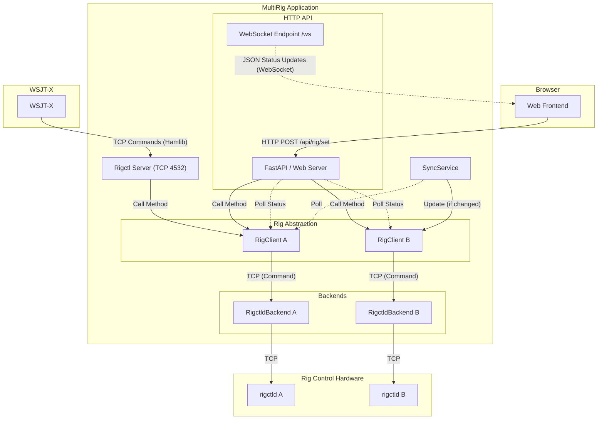

# Message Passing Architecture

This document describes how messages and commands flow through the MultiRig system.

## Overview

MultiRig acts as a central hub, receiving commands from external clients (like WSJT-X) and a web frontend, and dispatching them to multiple physical radios via `rigctld`. It also synchronizes state between radios.

## Component Diagram

## Data Flows

### 1. Command Flow (WSJT-X)
1.  **WSJT-X** connects to the **Rigctl Server** (default port 4532) via TCP.
2.  It sends Hamlib text protocol commands (e.g., `F 14074000`, `\dump_state`).
3.  **Rigctl Server** parses these commands and calls the corresponding methods on the targeted **RigClient** (usually the main rig).
4.  **RigClient** forwards the request to its **RigctldBackend**.
5.  **RigctldBackend** opens a TCP connection to the actual `rigctld` process and sends the raw command.

### 2. Command Flow (Web Frontend)
1.  The user interacts with the UI (e.g., changing frequency).
2.  The browser sends an **HTTP POST** request to `/api/rig/{idx}/set`.
3.  **FastAPI** handles the request and calls methods on the appropriate **RigClient**.
4.  **RigClient** forwards the command to the backend as above.

### 3. State Updates (Frontend)
1.  The browser opens a **WebSocket** connection to `/ws`.
2.  The backend runs an infinite loop that periodically polls all **RigClients** for their status (`safe_status()`).
3.  The status object (containing frequency, mode, connectivity, etc.) is serialized to JSON and sent over the WebSocket.
4.  The frontend receives the JSON and updates the UI (DOM) via `bindStatus`.

### 4. Synchronization (SyncService)
1.  The **SyncService** runs a background `asyncio` task.
2.  It polls the "source" rig (defined by configuration) at a set interval.
3.  If the source rig's frequency or mode has changed since the last poll:
    *   The service iterates through all "follower" rigs.
    *   It calls `set_frequency` and `set_mode` on the follower **RigClients** to match the source.
