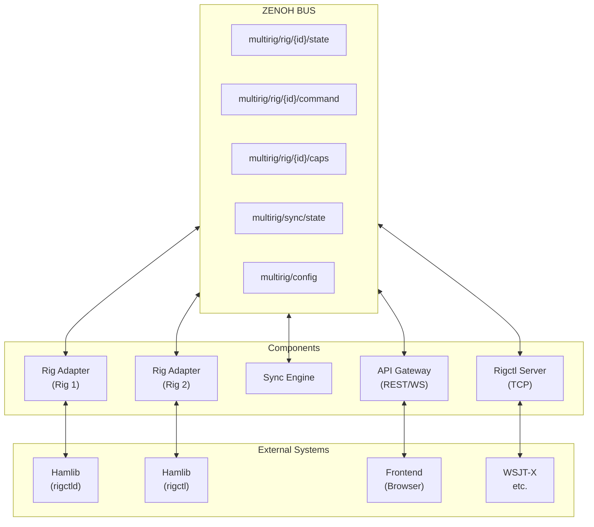
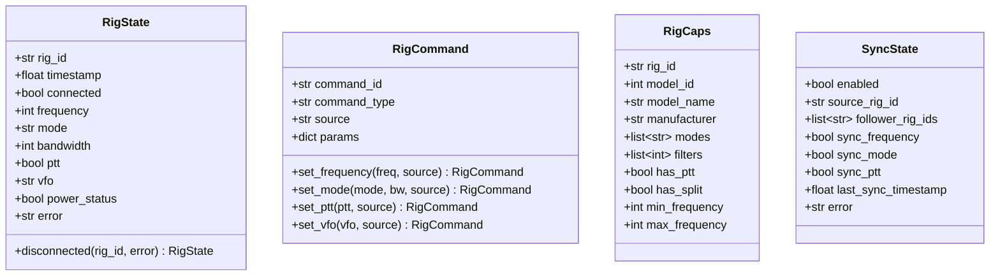
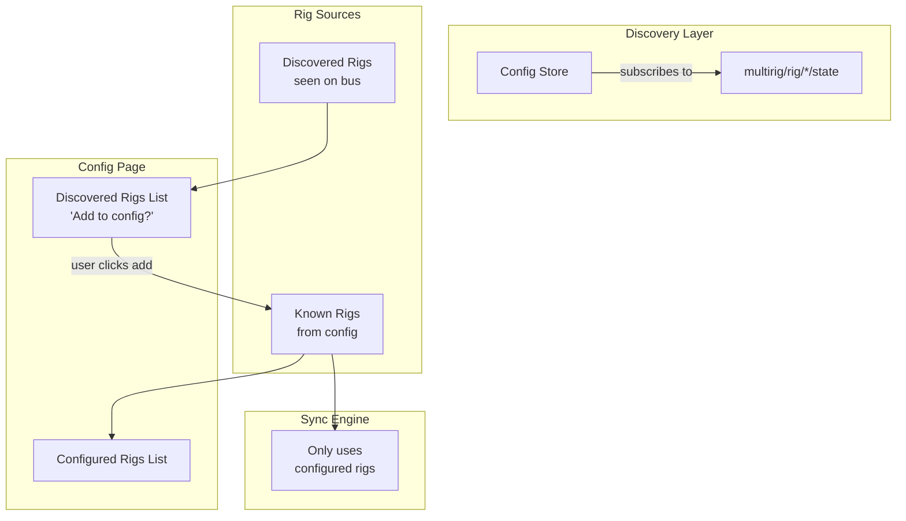
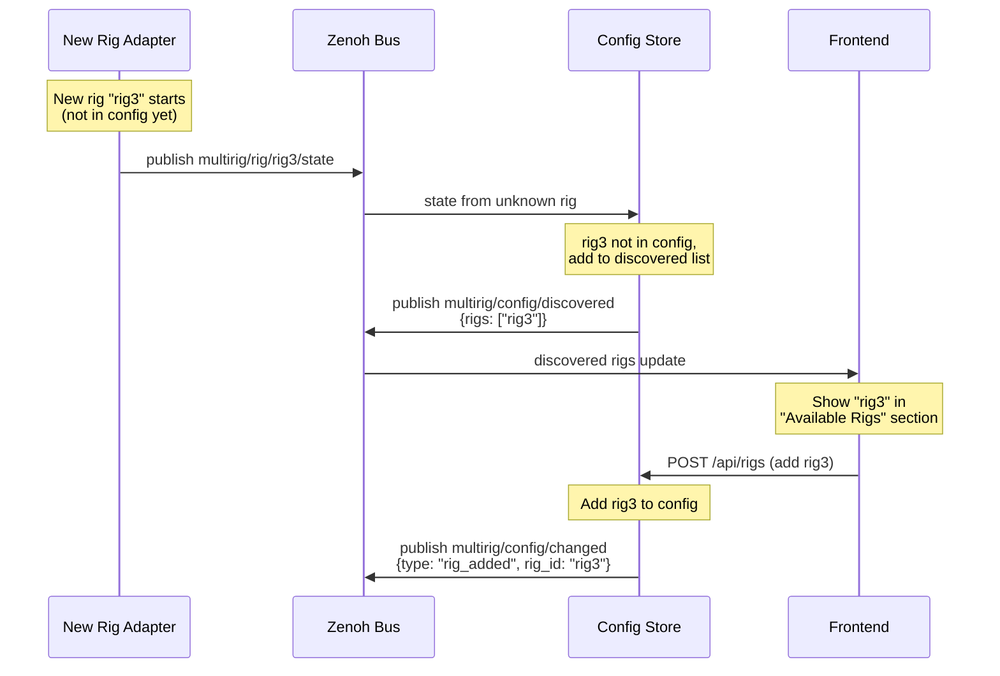

# MultiRig Zenoh Architecture

## Overview

This document describes the redesigned MultiRig backend using **Zenoh** as the core pub/sub messaging system. Zenoh provides zero-overhead pub/sub, storage, and query capabilities that simplify our architecture significantly.

### Why Zenoh?

The original MultiRig architecture had:
- Tight coupling between components (RigManager, RigClient, RigctlServer)
- Complex synchronization logic with polling
- Direct method calls that made testing and extension difficult

Zenoh solves these problems by:

- **Decoupling**: Components communicate via topics, not direct calls
- **Event-driven**: State changes propagate automatically via subscriptions
- **Extensibility**: New components just subscribe to relevant topics
- **Simplicity**: Less code, clearer data flow

---

## Architecture Diagram



### Zenoh Topics

| Topic | Description |
|-------|-------------|
| `multirig/rig/{id}/state` | Rig status (freq, mode, ptt, etc.) |
| `multirig/rig/{id}/command` | Commands TO the rig |
| `multirig/rig/{id}/caps` | Rig capabilities |
| `multirig/sync/state` | Sync engine state |
| `multirig/config` | Configuration (queryable) |
| `multirig/config/discovered` | List of discovered (unconfigured) rigs |
| `multirig/config/changed` | Config change notifications |

---

## Core Concepts

### 1. Key Expression Schema

Zenoh uses "key expressions" (like MQTT topics). Here's our schema:

| Key Expression | Purpose | Publisher | Subscribers |
|----------------|---------|-----------|-------------|
| `multirig/rig/{id}/state` | Current rig state | Rig Adapter | Sync Engine, API Gateway |
| `multirig/rig/{id}/command` | Commands to rig | API Gateway, Sync Engine | Rig Adapter |
| `multirig/rig/{id}/caps` | Rig capabilities | Rig Adapter | API Gateway |
| `multirig/sync/state` | Sync enabled/source | Sync Engine | API Gateway |
| `multirig/config` | Configuration (queryable) | Config Store | Any component |

### 2. Message Types

All messages are JSON-encoded Python dataclasses (or Pydantic models). This preserves the lesson learned from the original code about wrapping hamlib messages in structured types.

### 3. Component Responsibilities

| Component | What it does |
|-----------|--------------|
| **Rig Adapter** | Wraps hamlib, publishes state changes, executes commands, **enforces band limits**. |
| **Sync Engine** | Watches source rig, propagates changes to followers. |
| **API Gateway** | REST/WebSocket API, bridges HTTP to Zenoh. |
| **Config Store** | Manages configuration, queryable for settings. |
| **Rigctl Server** | TCP server for WSJT-X, bridges rigctl protocol to Zenoh. **Handles legacy stubs.** |

---

## Message Definitions



### RigState (published to `multirig/rig/{id}/state`)

```python
@dataclass
class RigState:
    rig_id: str
    timestamp: float
    connected: bool
    frequency: Optional[int] = None      # Hz
    mode: Optional[str] = None           # USB, LSB, CW, etc.
    bandwidth: Optional[int] = None      # Hz
    ptt: Optional[bool] = None
    vfo: Optional[str] = None            # VFOA, VFOB
    power_status: Optional[bool] = None
    error: Optional[str] = None
```

### RigCommand (published to `multirig/rig/{id}/command`)

```python
@dataclass
class RigCommand:
    command_id: str              # UUID for tracking
    command_type: str            # "set_frequency", "set_mode", etc.
    source: str                  # Who sent it: "api", "sync", "rigctl"
    params: dict                 # Command-specific parameters
```

### RigCaps (published to `multirig/rig/{id}/caps`)

```python
@dataclass
class RigCaps:
    rig_id: str
    model: str
    manufacturer: str
    modes: list[str]
    filters: list[int]
    has_ptt: bool
    has_split: bool
    # ... other capability flags
```

### SyncState (published to `multirig/sync/state`)

```python
@dataclass
class SyncState:
    enabled: bool
    source_rig_id: Optional[str]
    follower_rig_ids: list[str]
    sync_frequency: bool
    sync_mode: bool
    sync_ptt: bool
```

---

## Component Details

### Rig Adapter

The Rig Adapter is the bridge between Zenoh and a physical rig (via hamlib).

**Responsibilities:**
1. Connect to rig via hamlib.
    - **Rigctld Adapter:** Connects to existing TCP rigctld.
    - **Managed Adapter:** Spawns `rigctld` subprocess and connects via TCP (robust process management).
2. Poll rig state periodically (or on demand).
3. Publish state changes to `multirig/rig/{id}/state`.
4. Subscribe to `multirig/rig/{id}/command`.
5. **Enforce Safety:** Check commands against configured band limits and constraints *before* execution.
6. Publish capabilities to `multirig/rig/{id}/caps` (using full `dump_caps` parsing).

**Key Design Points:**
- Each rig has its own adapter instance.
- Adapters are independent - they don't know about each other.
- State changes are detected by comparing current vs previous state.
- Only changed values are significant (reduces noise).

### Sync Engine

The Sync Engine propagates changes from the source rig to followers.

**Responsibilities:**
1. Subscribe to all `multirig/rig/+/state` topics.
2. When source rig state changes, publish commands to follower rigs.
3. Publish sync state to `multirig/sync/state`.
4. Handle sync enable/disable via config changes.

**Key Design Points:**
- Simple state machine: watch source, copy to followers.
- Configurable what to sync (freq, mode, ptt).
- Debouncing to avoid command floods.

### API Gateway

The API Gateway provides HTTP REST and WebSocket APIs for the frontend.

**Responsibilities:**
1. REST endpoints for configuration, rig control.
2. WebSocket for real-time state updates.
3. Subscribe to Zenoh topics and forward to WebSocket clients.
4. Convert REST requests to Zenoh commands.

**Key Design Points:**
- Thin layer - most logic is in other components.
- Uses FastAPI for REST/WebSocket.
- Stateless - all state comes from Zenoh.

### Config Store

The Config Store manages persistent configuration.

**Responsibilities:**
1. Load/save configuration from YAML files.
2. Provide queryable endpoint at `multirig/config`.
3. Publish config changes for reactive updates.
4. **Discover new rigs** by watching for unknown rig state messages.

**Key Design Points:**
- Uses Zenoh queryables for request/response.
- Configuration is the source of truth for rig definitions.
- Profile support for different setups.

---

## Rig Discovery (Hybrid Approach)

The system uses a **hybrid discovery + config-driven** approach for managing rigs:

### How It Works



### Discovery Flow



### Key Points

1. **Discovery is passive**: The Config Store watches `multirig/rig/*/state` for any rig IDs not in the current configuration.
2. **Config is authoritative**: The Sync Engine only operates on rigs that are explicitly in the configuration.
3. **User-driven addition**: Discovered rigs are presented to the user on the config page, but don't automatically become part of sync.
4. **Easy onboarding**: When a user starts a new rigctld instance, it appears in the UI as "discovered" and can be added with one click.

### New Topics for Discovery

| Topic | Purpose | Publisher | Subscribers |
|-------|---------|-----------|-------------|
| `multirig/config/discovered` | List of discovered (unconfigured) rigs | Config Store | API Gateway |
| `multirig/config/changed` | Config change notifications | Config Store | Sync Engine, Adapters |

### ConfigDiscovered Message

```python
@dataclass
class ConfigDiscovered:
    """
    List of rigs discovered on the bus but not in config.
    
    Published to: multirig/config/discovered
    """
    discovered_rigs: list[DiscoveredRig]
    timestamp: float

@dataclass
class DiscoveredRig:
    """Info about a discovered rig."""
    rig_id: str
    first_seen: float
    last_seen: float
    connected: bool
    model_name: Optional[str] = None  # From caps if available
```

### ConfigChanged Message

```python
@dataclass
class ConfigChanged:
    """
    Notification that configuration has changed.
    
    Published to: multirig/config/changed
    """
    change_type: str  # "rig_added", "rig_removed", "rig_updated", "sync_updated"
    rig_id: Optional[str] = None
    timestamp: float
```

### Rigctl Server

The Rigctl Server allows external apps (WSJT-X, etc.) to control rigs.

**Responsibilities:**
1. Listen on TCP port (like rigctld).
2. Parse rigctl protocol commands (Full command map including stubs like `get_level`, `dump_caps`, `chk_vfo`).
3. Convert to Zenoh commands/queries.
4. Return responses in rigctl format.
5. **Optimistic Updates:** May cache latest known state to ensure immediate responses to clients like WSJT-X.

**Key Design Points:**
- Reuses hamlib message types from original code.
- Acts as a bridge between rigctl protocol and Zenoh.
- Can target any rig or the "virtual" synced rig.

---

## Directory Structure

```
multirig/
├── __main__.py              # Entry point
├── app.py                   # FastAPI app setup, Zenoh session
├── config.py                # Configuration models (Pydantic)
├── profiles.py              # Profile management
│
├── zenoh/                   # Zenoh-specific code
│   ├── __init__.py
│   ├── session.py           # Zenoh session management
│   ├── keys.py              # Key expression constants
│   └── serialization.py     # JSON encode/decode helpers
│
├── messages/                # Message type definitions
│   ├── __init__.py
│   ├── rig.py               # RigState, RigCommand, RigCaps
│   ├── sync.py              # SyncState
│   └── config.py            # ConfigMessage types
│
├── adapters/                # Rig adapters
│   ├── __init__.py
│   ├── base.py              # BaseRigAdapter interface
│   ├── rigctld.py           # rigctld TCP adapter
│   └── managed.py           # Spawns rigctld subprocess
│
├── engines/                 # Business logic engines
│   ├── __init__.py
│   ├── sync.py              # Sync engine
│   └── config_store.py      # Config queryable
│
├── gateway/                 # API gateway
│   ├── __init__.py
│   ├── routes.py            # REST endpoints
│   └── websocket.py         # WebSocket handler
│
├── rigctl_server/           # External app support
│   ├── __init__.py
│   ├── server.py            # TCP server
│   └── protocol.py          # Protocol handling (from old code)
│
├── hamlib/                  # Hamlib utilities (preserved from old)
│   ├── __init__.py
│   ├── messages.py          # Command types
│   ├── parser.py            # Protocol parsing
│   ├── caps.py              # Capabilities parsing (NEW)
│   └── formatter.py         # Response formatting
│
└── static/                  # Frontend (unchanged)
    └── ...
```

---

## Dependencies

Add to `pyproject.toml`:

```toml
[project]
dependencies = [
    "fastapi>=0.100.0",
    "uvicorn>=0.20.0",
    "eclipse-zenoh>=1.0.0",
    "pydantic>=2.0.0",
    "pyyaml>=6.0",
    # ... other deps
]
```

---

## Next Steps

See [zenoh-implementation-plan.md](./zenoh-implementation-plan.md) for the phased implementation guide.